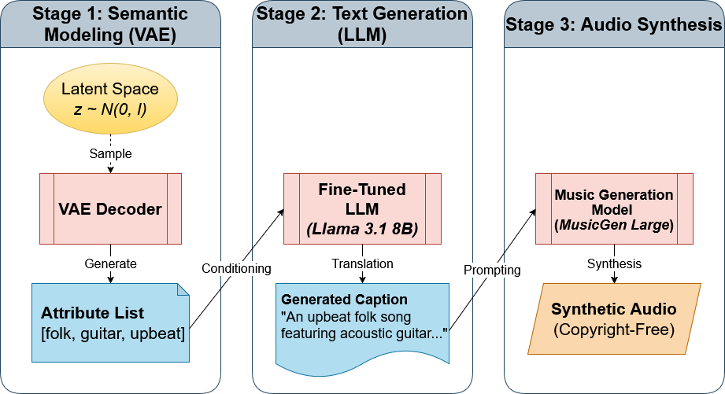

---
annotations_creators:
- machine-generated
language_creators:
- machine-generated
language:
- en
license:
- cc-by-4.0
multilinguality:
- monolingual
size_categories:
- 10K<n<100K
source_datasets:
- google/MusicCaps
task_categories:
- text-generation
- text-to-audio
- multi-modal-learning
task_ids:
- natural-language-inference
- semantic-similarity-classification
pretty_name: ConceptCaps
tags:
- music
- audio
- captions
- text-to-audio
- music-generation
- interpretability
- synthetic
- musicgen
- concepts
- tcav
- audio-captioning
---

# Dataset Card for ConceptCaps

## Table of Contents
- [Dataset Card for ConceptCaps](#dataset-card-for-conceptcaps)
  - [Table of Contents](#table-of-contents)
  - [Dataset Description](#dataset-description)
    - [Dataset Summary](#dataset-summary)
    - [Key Features](#key-features)
    - [Supported Tasks and Leaderboards](#supported-tasks-and-leaderboards)
    - [Languages](#languages)
  - [Dataset Structure](#dataset-structure)
    - [Data Splits](#data-splits)
    - [Data Fields](#data-fields)
    - [Data Instances](#data-instances)
    - [Data Fields](#data-fields-1)
    - [Source Data](#source-data)
      - [Initial Data Collection and Normalization](#initial-data-collection-and-normalization)
    - [Annotations](#annotations)
      - [Used Models](#used-models)
      - [Annotation process](#annotation-process)
      - [Who are the annotators?](#who-are-the-annotators)
    - [Personal and Sensitive Information](#personal-and-sensitive-information)
  - [Considerations for Using the Data](#considerations-for-using-the-data)
    - [Social Impact of Dataset](#social-impact-of-dataset)
    - [Discussion of Biases](#discussion-of-biases)
    - [Other Known Limitations](#other-known-limitations)
  - [Considerations for Using the Data](#considerations-for-using-the-data-1)
    - [Social Impact of Dataset](#social-impact-of-dataset-1)
    - [Discussion of Biases](#discussion-of-biases-1)
  - [Additional Information](#additional-information)
    - [Dataset Curators](#dataset-curators)
    - [Licensing Information](#licensing-information)
    - [Citation Information](#citation-information)
    - [Contributions](#contributions)
  - [Usage Examples](#usage-examples)
    - [Load the default configuration (captions only):](#load-the-default-configuration-captions-only)
    - [Load with audio:](#load-with-audio)
    - [Load smaller subsets for quick experimentation:](#load-smaller-subsets-for-quick-experimentation)

## Dataset Description

- **Homepage:** [Hugging Face Dataset](https://huggingface.co/datasets/bsienkiewicz/ConceptCaps)
- **Repository:** [GitHub Repository](https://github.com/BrunoSienkiewicz/ConceptCaps)
- **Paper:** [arXiv:2601.14157](https://arxiv.org/abs/2601.14157)
- **Leaderboard:** N/A
- **Point of Contact:** Bruno Sienkiewicz

### Dataset Summary


ConceptCaps is a music captioning dataset derived from MusicCaps, specifically designed for concept-based interpretability research in text-to-audio (TTA) generation systems. The dataset provides categorized musical concept annotations from a distilled taxonomy (200 unique tags) alongside natural language captions, enabling fine-grained analysis of how TTA models represent and generate musical concepts.

Unlike existing datasets with noisy or sparse tags, ConceptCaps utilizes a novel generative pipeline separating semantic consistency (via VAE) from linguistic quality (via LLM) to create 21k high-quality music-caption-audio triplets.

The dataset is available in **2 versions**: 
1. **Default:** Text-only (captions + aspect lists).
2. **Audio:** Full triplets including generated audio files.

### Key Features

- **21k music-caption-audio triplets** with explicit labels from a 200-attribute taxonomy.
- **178 hours of audio content** paired with textual descriptions.
- **Four concept categories**: Genre, Mood, Instruments, Tempo.
- **Separated semantic modeling from text generation**: A Beta-VAE learns attribute co-occurrence, while a fine-tuned Llama 3.1 model generates descriptions.
- **Validated through multiple metrics**: High audio-text alignment, linguistic quality and concept separability (verified via TCAV).

The dataset is available in 2 versions: with and without audio. All captions are in English.

### Supported Tasks and Leaderboards

- `text-generation`: The dataset can be used to train a model for music caption generation, which consists in generating natural language descriptions of music based on musical concept tags. Success on this task is typically measured by achieving high scores on metrics such as [BERTScore](https://huggingface.co/metrics/bertscore), MAUVE, and CLAP alignment.

- `text-to-audio`: The dataset can be used to train or evaluate text-to-audio generation models, which generate audio from textual descriptions. The captions provide structured musical concept information that can improve controllability in audio generation.

### Languages

The captions in ConceptCaps are in English (BCP-47: `en`).

## Dataset Structure

### Data Splits

| Configuration | Train | Validation | Test | Total |
|--------------|-------|------------|------|-------|
| default | 15003 | 3,215 | 3,215 | 21,433 |
| 25pct | 3,750 | 803 | 803 | 5,356 |
| 10pct | 1500 | 321 | 321 | 2,142 |

Splits follow a standard **70/15/15** ratio for train/validation/test.

### Data Fields

| Field | Type | Description |
|-------|------|-------------|
| `id` | string | Unique identifier for the sample |
| `caption` | string | Natural language description of the music |
| `aspect_list` | string | Stringified list of all musical concept tags |
| `genre_aspects` | list[string] | Genre-related tags (e.g., "jazz", "rock", "classical") |
| `mood_aspects` | list[string] | Mood/emotion tags (e.g., "mellow", "energetic", "sad") |
| `instrument_aspects` | list[string] | Instrument tags (e.g., "piano", "guitar", "drums") |
| `tempo_aspects` | list[string] | Tempo-related tags (e.g., "slow", "fast", "moderate") |
| `file_name` | Audio | (Audio versions only) Audio file data |

### Data Instances

A typical data instance looks like:

```json
{
  "id": "b5fb15e8252105205ac5fb8053745993",
  "caption": "This slow pop-rock track features a melancholic guitar-driven arrangement at a relaxed pace, accompanied only by minimalist instrumental textures without any percussive elements or vocal components. [...]",
  "aspect_list": "['guitar', 'no percussion', 'no voices', 'pop', 'slow rock', 'slow tempo']",
  "genre_aspects": ["pop", "slow rock"],
  "mood_aspects": [],
  "instrument_aspects": ["guitar", "no percussion", "no voices"],
  "tempo_aspects": ["slow tempo"]
}
```

For audio versions, an additional `file_name` field contains the audio data.

### Data Fields

### Source Data

#### Initial Data Collection and Normalization

ConceptCaps is derived from [MusicCaps](https://huggingface.co/datasets/google/MusicCaps), a dataset of 5,521 music clips with expert-written captions from YouTube. The original `aspect_list` annotations were systematically filtered and categorized into four concept categories to create a curated taxonomy. Using this taxonomy, the authors distilled the original MusicCaps dataset to create clean pairs of `aspect_list` and `caption` used to train the downstream generative components.



ConceptCaps was created to enable interpretability research in text-to-audio generation. Existing music captioning datasets often contain noisy, synonyms-heavy, or sparse tags, making it difficult to perform concept interpretability research (e.g., using TCAV). By distilling and categorizing musical aspects (genre, mood, instruments, tempo), ConceptCaps provides a strong foundation for auditing how models learn specific musical concepts.

### Annotations

#### Used Models

The dataset generation relies on a three-stage pipeline using the following models:
- **Semantic Modeling**: Custom **Beta-VAE** (β-VAE) with a 256-dimensional latent space to model attribute co-occurrences.
- **Text Generation**: **Llama-3.1-8B-Instruct** fine-tuned with QLoRA on the distilled MusicCaps data.
- **Audio Generation**: **MusicGen** (Facebook/Meta) used to synthesize audio conditioned on the generated captions.

#### Annotation process

1. **Concept Extraction**: Tags from MusicCaps `aspect_list` were mapped to four categories (genre, mood, instrument, tempo) using a curated taxonomy
2. **Tag Generation**: Tag combinations were generated using a custom VAE trained on the curated dataset tag combinations
3. **Caption Extrapolation**: A fine-tuned LLM generated natural language captions conditioned on the obtained annotation combinations
4. **Audio Inference**: Audio samples were generated using the extrapolated captions

#### Who are the annotators?

The annotations are machine-generated. The original MusicCaps tags were created by expert human annotators, but the ConceptCaps taxonomy mapping, tag generation (VAE), and caption generation (LLM) were performed by machine learning models developed by the dataset curators.

### Personal and Sensitive Information

The dataset does not contain personal or sensitive information. The audio content is derived from publicly available music on YouTube, and the captions describe musical attributes without referencing individuals.

## Considerations for Using the Data

### Social Impact of Dataset

ConceptCaps aims to advance interpretability research in text-to-audio generation, which can lead to more transparent and controllable AI music generation systems. This has positive implications for:
- Understanding how AI models represent musical concepts
- Enabling more precise control over generated music
- Supporting research into AI safety and alignment in creative domains

Potential risks include the use of generated captions or audio for deceptive purposes, though the dataset's focus on interpretability research provides safeguards through increased model transparency.

### Discussion of Biases

The dataset inherits potential biases from its source:
- **MusicCaps bias**: The original dataset was sourced from YouTube, which may not represent all musical genres and cultures equally
- **Taxonomy bias**: The 200-tag taxonomy was curated based on the MusicCaps data distribution, which may underrepresent certain musical traditions
- **Language bias**: Captions are only available in English, limiting accessibility for non-English speakers

### Other Known Limitations

- The dataset relies on machine-generated captions, which may occasionally contain inaccuracies or inconsistencies
- Audio versions require significant storage space (178 hours of audio content)
- The taxonomy is limited to 200 tags across four categories, which may not capture all nuances of musical description

## Considerations for Using the Data

### Social Impact of Dataset
ConceptCaps facilitates research into **interpretability** and **explainability** of audio generation models. By providing a controlled environment with explicit concept tags, it allows researchers to audit models for bias and concept erasure.

### Discussion of Biases

* **Source Bias:** As a derivative of MusicCaps (which is based on AudioSet/YouTube), the dataset likely retains Western-centric musical biases.
* **Model Bias:** The audio is generated by MusicGen and the text by Llama 3. Any biases inherent in these models (e.g., specific associations between "sad" mood and "minor key") are baked into this dataset.
* **Synthetic Nature:** Users should be aware that this is **synthetic data**. It represents the statistical likelihood of how MusicGen *interprets* concepts, not necessarily how real acoustic instruments always sound.

## Additional Information

### Dataset Curators

This dataset was created by Bruno Sienkiewicz, Łukasz Neumann, and Mateusz Modrzejewski (Warsaw University of Technology) as part of research on interpretability in text-to-audio generation systems.

### Licensing Information

This dataset is released under the [CC-BY-4.0 License](https://creativecommons.org/licenses/by/4.0/).

### Citation Information

If you use ConceptCaps in your research, please cite:

```bibtex
@article{sienkiewicz2026conceptcaps,
  title={ConceptCaps -- a Distilled Concept Dataset for Interpretability in Music Models},
  author={Sienkiewicz, Bruno and Neumann, Łukasz and Modrzejewski, Mateusz},
  journal={arXiv preprint arXiv:2601.14157},
  year={2026}
}
```

### Contributions

Thanks to [@BrunoSienkiewicz](https://arxiv.org/search/cs?searchtype=author&query=Sienkiewicz,+B), [@LukaszNeumann](https://arxiv.org/search/cs?searchtype=author&query=Neumann,+%C5%81), and [@MateuszModrzejewski](https://arxiv.org/search/cs?searchtype=author&query=Modrzejewski,+M) for creating this dataset.

## Usage Examples

### Load the default configuration (captions only):

```python
from datasets import load_dataset

dataset = load_dataset("bsienkiewicz/ConceptCaps", "default")
print(dataset["train"][0])
```

### Load with audio:

```python
dataset = load_dataset("bsienkiewicz/ConceptCaps", "audio")

# access audio
sample = dataset["train"][0]
audio_array = sample["file_name"]["array"]
sampling_rate = sample["file_name"]["sampling_rate"]
```

### Load smaller subsets for quick experimentation:

```python
# 10% subset without audio
dataset_small = load_dataset("bsienkiewicz/ConceptCaps", "10pct")

# 25% subset with audio
dataset_medium = load_dataset("bsienkiewicz/ConceptCaps", "25pct-audio")
```